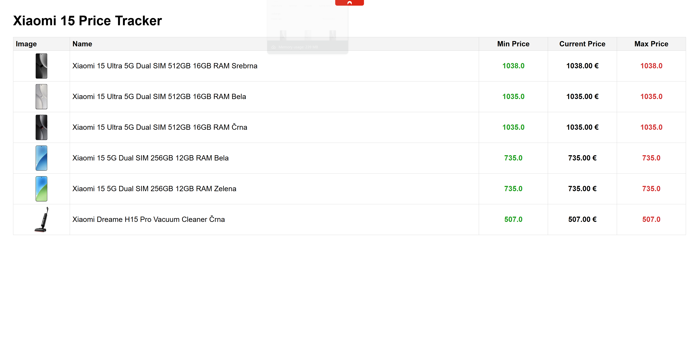

# mobileshop-eu-price-tracker

Track and visualize price changes for Xiaomi 15 smartphones on [mobileshop.eu](https://www.mobileshop.eu/si/iskanje/?keyword=Xiaomi+15) with a simple Flask web app.

## Features
- Scrapes product data (name, price, image, link) from mobileshop.eu
- Tracks price history in a local SQLite database
- Displays min, current, and max prices for each product
- Simple web interface with clickable product rows

## Demo
 <!-- Add a screenshot if available -->

## Requirements
- Python 3.7+
- See `requirements.txt` for Python dependencies

## Setup
1. Clone this repository:
	```sh
	git clone https://github.com/TheFatPanda-Dev/mobileshop-eu-price-tracker.git
	cd mobileshop-eu-price-tracker
	```
2. Install dependencies:
	```sh
	pip install -r requirements.txt
	```
3. Run the app:
	```sh
	python app.py
	```
4. Open your browser and go to [http://localhost:5000](http://localhost:5000)

## Project Structure
- `app.py` - Flask app entry point
- `mobileshop_eu.py` - Web scraper for mobileshop.eu
- `price_db.py` - SQLite database logic for price tracking
- `templates/` - HTML templates (Jinja2)
- `static/` - CSS styles
- `prices.db` - SQLite database (auto-created)

## Customization
- To track a different search or product, change the `URL` variable in `app.py`.

## License
MIT License. See [LICENSE](LICENSE) for details.

## Credits
- [Flask](https://flask.palletsprojects.com/)
- [BeautifulSoup](https://www.crummy.com/software/BeautifulSoup/)
- [mobileshop.eu](https://www.mobileshop.eu/) (for data)